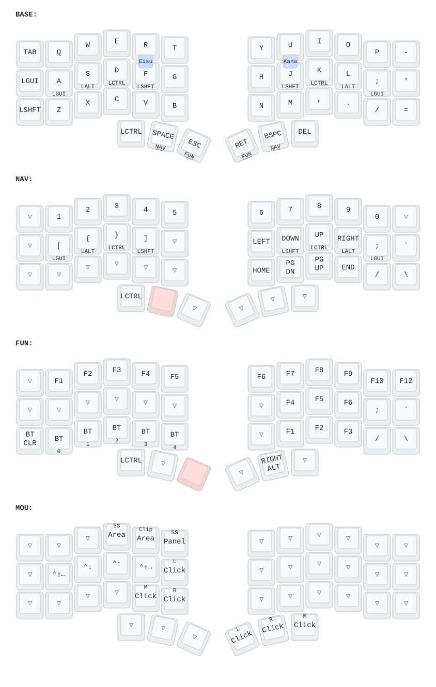

# ZMK config for beekeeb Toucan2 Keyboard

[The beekeeb Toucan2 Keyboard](https://beekeeb.com/introducing-toucan2/) is a wireless split 42-key column‑stagger keyboard that has a display and a trackpad, with an aggressive stagger on the pinky columns.

# Keymap



Four layers, all reached from the thumbs:

| Layer | How to reach it | What it holds |
| --- | --- | --- |
| BASE | — | Letters, home row mods |
| NAV | Hold left `Space` or right `Backspace` | Digits, brackets, arrows, `Home`/`End`/`PgUp`/`PgDn` |
| FUN | Hold left `Esc` or right `Enter` | `F1`–`F12`, Bluetooth profiles on the left bottom row |
| MOU | Automatic mouse layer — active while a finger rests on the trackpad | Thumbs become mouse buttons |

Details that the picture cannot show:

- **Home row mods** sit on `A`/`S`/`D`/`F` and `J`/`K`/`L`/`;` — Cmd, Alt, Ctrl, Shift, mirrored. Cmd and Ctrl are swapped relative to their usual places on purpose. They are timerless: `tapping-term-ms` is 2000 ms and the hold is decided purely by *which* key comes next. `hold-trigger-key-positions` only lists the opposite hand plus the thumbs, so same-hand rolls always tap. `require-prior-idle-ms = 150` keeps fast typing from turning into modifiers.
- The **NAV layer carries the same home row mods** on the same physical keys.

The picture is generated from `config/toucan.keymap`, so regenerate it after every keymap change:

```bash
./scripts/draw-keymap.sh    # writes docs/keymap.svg
```

It uses [keymap-drawer](https://github.com/caksoylar/keymap-drawer) through `uvx`, with the label overrides in [keymap_drawer.config.yaml](keymap_drawer.config.yaml) and the physical layout read straight out of the shield's `default_layout`.

# Trackpad gestures

NAV is the only layer that changes the trackpad. Every other layer uses the base input-processor chain.

| Gesture | Every layer but NAV | NAV |
| --- | --- | --- |
| One-finger drag | Move the cursor | Scroll (both axes inverted) |
| One-finger drag inside the rightmost 4% | Scroll vertically (edge scrolling) | Scroll vertically |
| Two-finger swipe, horizontal | Scroll horizontally | Switch workspaces (`⌃⇧←` / `⌃⇧→`) |
| Two-finger swipe, vertical | Scroll vertically | Mission Control / App Exposé (`⌃↑` / `⌃↓`) |
| Three-finger swipe, up / down / left / right | `⌃↑` / `⌃↓` / `⌃⇧←` / `⌃⇧→` | — |
| Pinch | Zoom (`⌘-` / `⌘=`) | — |
| Tap / two-finger tap / press and hold | Click / right click / hold, all from the driver | same |
| Touching the pad at all | Holds the MOU layer, so the thumbs are left/right/middle click | — |

The rightmost 4% of the pad is an edge-scroll strip: put a finger down there and drag up or down and it scrolls vertically instead of moving the cursor, on every layer. The strip is latched when the finger lands, so drifting out of it mid-drag keeps scrolling; starting outside it never scrolls.

Workspace switching is a personal setting, not a macOS default: this config sends `⌃⇧←` / `⌃⇧→`, which are what "Move left/right a space" are bound to in System Settings here.

Every scrolling gesture goes through the two-stage speed and momentum: swipe gently and nothing changes, flick and the scroll keeps coasting until you touch the pad again.

The gaps in the NAV column are not oversights: a layer override that matches replaces the base processor chain outright, and the NAV chain deliberately leaves out `zip_zoom_mapper`, `swipe_button_mapper` and `is_touching_processor`. Button events are untouched by any of this, so tapping still clicks on every layer.

Every shortcut gesture assumes macOS. Define `TOUCAN_WIN_MODE` at the top of [boards/shields/toucan/toucan.dtsi](boards/shields/toucan/toucan.dtsi) to switch the zoom, two-finger and three-finger bindings to their Windows equivalents.

# License

The code in this repo is available under the MIT license.

The included shield nice_view_gem is modified from https://github.com/M165437/nice-view-gem licensed under the MIT License.

The linked trackpad module is based on https://github.com/geeksville/zmk_driver_azoteq

ZMK code snippets are taken from the ZMK documentation under the MIT license.

The embedded font QuinqueFive is designed by GGBotNet, licensed under under the SIL Open Font License, Version 1.1.
